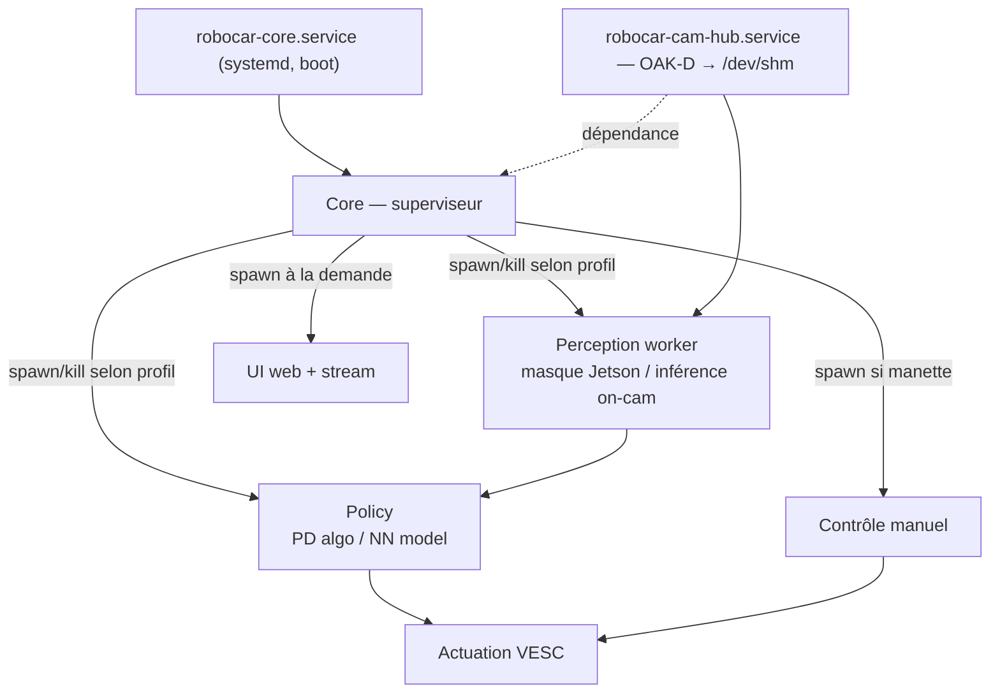

# Architecture — superviseur + workers

Le core orchestre ; le `cam-hub` est un service séparé (dépendance). Les workers sont
spawn/kill par le core selon le profil et le contexte.

```mermaid
flowchart TD
    SYS["robocar-core.service (systemd, boot)"] --> CORE["Core — superviseur"]
    HUB["robocar-cam-hub.service — OAK-D → /dev/shm"] -. dépendance .-> CORE

    CORE -->|spawn/kill selon profil| PERC["Perception worker<br/>masque Jetson / inférence on-cam"]
    CORE -->|spawn/kill selon profil| POL["Policy<br/>PD algo / NN model"]
    CORE -->|spawn à la demande| UI["UI web + stream"]
    CORE -->|spawn si manette| MAN["Contrôle manuel"]

    HUB --> PERC
    PERC --> POL
    POL --> VESC["Actuation VESC"]
    MAN --> VESC
```
