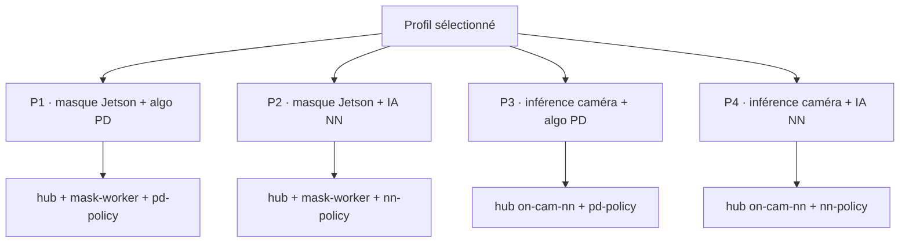

# Profils d'usage

Combinaison *lieu de perception × intelligence*. Le profil détermine quels workers le core lance.

| Profil | Perception | Intelligence | Charge Jetson |
|---|---|---|---|
| P1 | masque sur Jetson | algo (PD) | moyenne |
| P2 | masque sur Jetson | IA (NN Jetson) | élevée |
| P3 | inférence dans la caméra | algo (PD) | faible |
| P4 | inférence dans la caméra | IA | faible |
