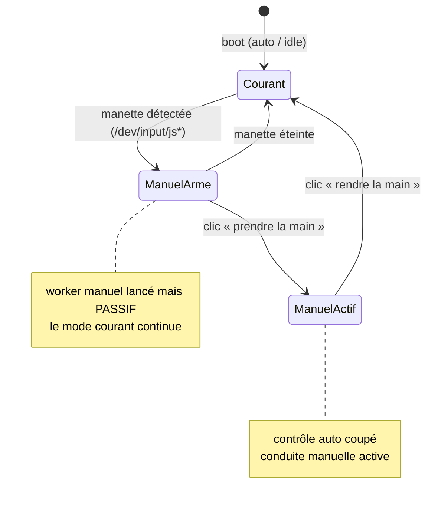

# Manette — prise de main explicite

Détecter l'allumage de la manette n'interrompt PAS le mode courant : ça **arme** le manuel.
Seul un clic explicite **prend la main** et coupe l'auto.

```mermaid
stateDiagram-v2
    [*] --> Courant: boot (auto / idle)

    Courant --> ManuelArme: manette détectée (/dev/input/js*)
    ManuelArme --> Courant: manette éteinte

    ManuelArme --> ManuelActif: clic « prendre la main »
    ManuelActif --> Courant: clic « rendre la main »

    note right of ManuelArme
        worker manuel lancé mais PASSIF
        le mode courant continue
    end note
    note right of ManuelActif
        contrôle auto coupé
        conduite manuelle active
    end note
```
