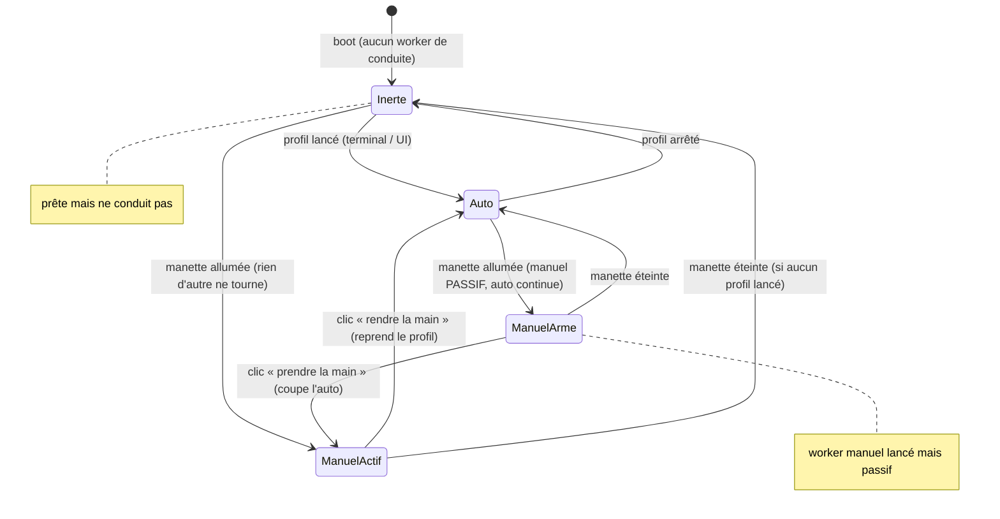

# États & prise de main

Au boot : **Inerte** (aucun worker de conduite). On en sort par un trigger explicite (profil
lancé → Auto, ou manette → Manuel). Si l'auto tourne, allumer la manette **arme** le manuel
(passif) ; seul un clic explicite **prend la main** et coupe l'auto.

