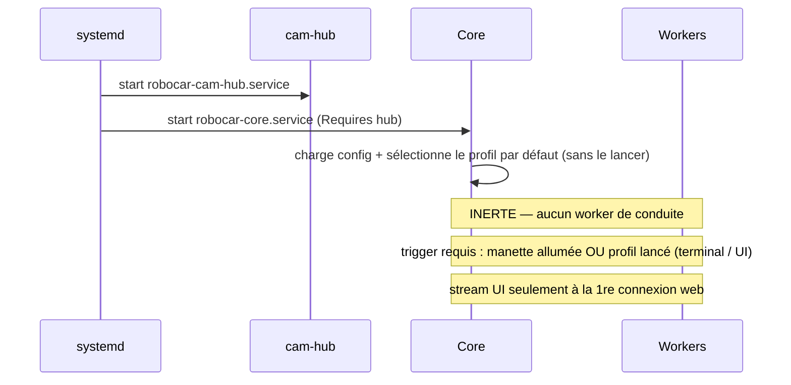

# Boot & cycle de vie

Au boot, systemd lance le hub puis le core. Le core charge la config et reste **inerte** :
**aucun worker de conduite** tant qu'il n'y a pas de trigger (manette ou profil lancé).

