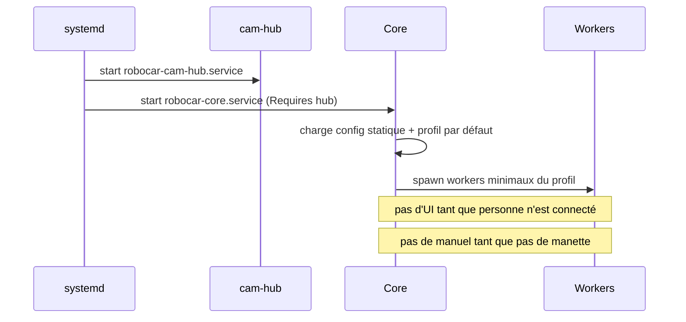

# Boot & cycle de vie

Au boot, systemd lance le hub puis le core ; le core charge la config et ne spawn que le
minimum du profil. L'UI et le manuel viennent à la demande.

```mermaid
sequenceDiagram
    participant SYS as systemd
    participant HUB as cam-hub
    participant CORE as Core
    participant W as Workers

    SYS->>HUB: start robocar-cam-hub.service
    SYS->>CORE: start robocar-core.service (Requires hub)
    CORE->>CORE: charge config statique + profil par défaut
    CORE->>W: spawn workers minimaux du profil
    Note over CORE,W: pas d'UI tant que personne n'est connecté
    Note over CORE,W: pas de manuel tant que pas de manette
```
