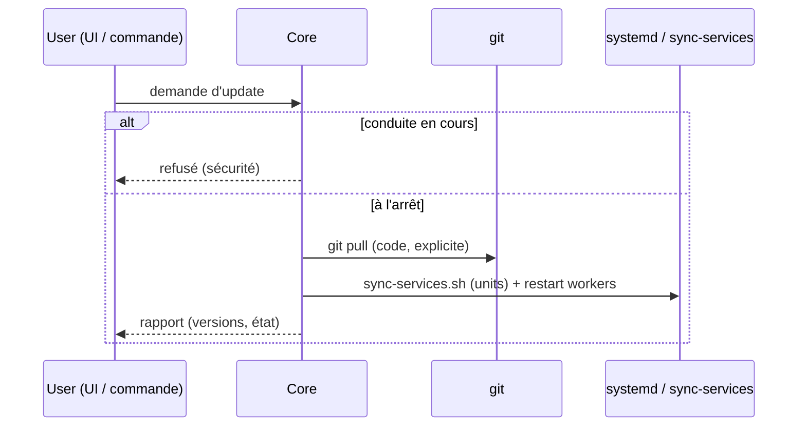

# Flux d'update

L'update est **explicite** (déclenché par l'user), refusé en conduite. Le core fait le git pull
puis synchronise les services et relance les workers concernés.

```mermaid
sequenceDiagram
    participant U as User (UI / commande)
    participant CORE as Core
    participant GIT as git
    participant SYS as systemd / sync-services

    U->>CORE: demande d'update
    alt conduite en cours
        CORE-->>U: refusé (sécurité)
    else à l'arrêt
        CORE->>GIT: git pull (code, explicite)
        CORE->>SYS: sync-services.sh (units) + restart workers
        CORE-->>U: rapport (versions, état)
    end
```
