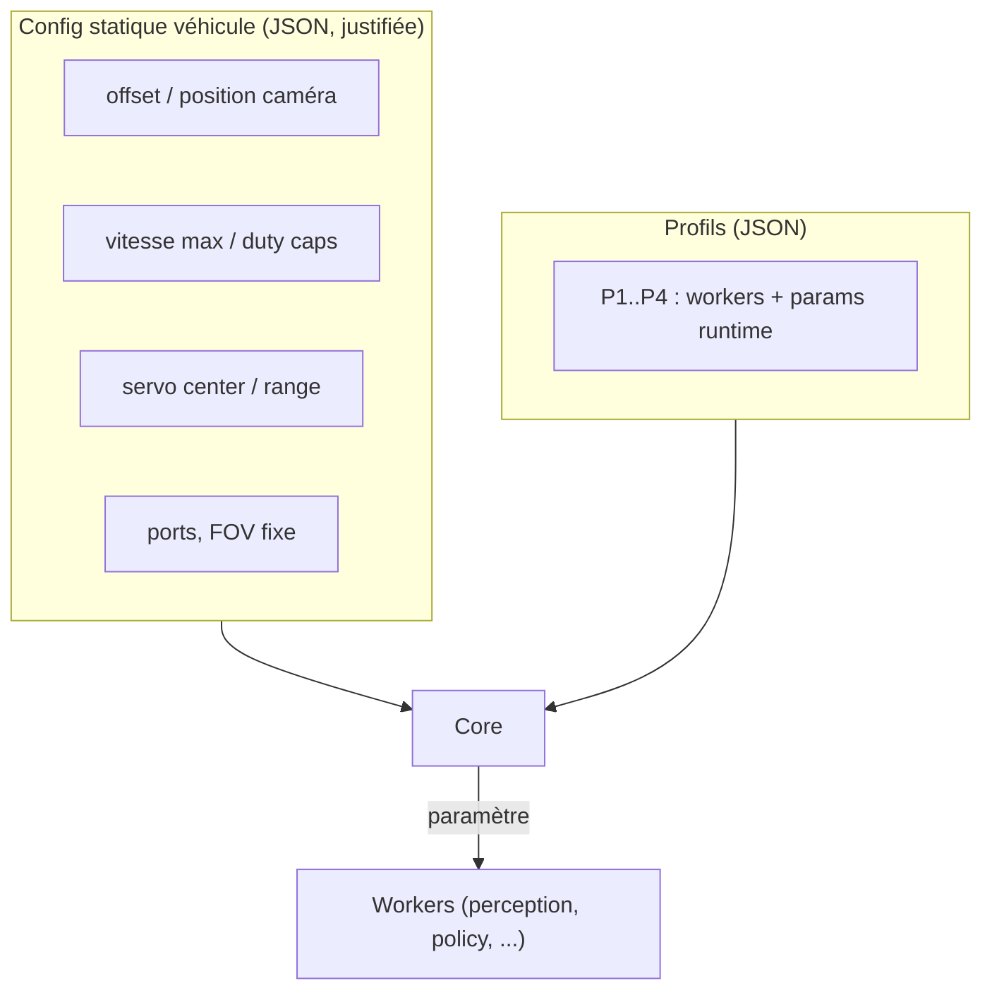

# Couches de configuration

Deux configs JSON distinctes : la vérité matérielle figée vs la sélection de mode runtime.

```mermaid
flowchart TD
    subgraph STAT["Config statique véhicule (JSON, justifiée)"]
        V1["offset / position caméra"]
        V2["vitesse max / duty caps"]
        V3["servo center / range"]
        V4["ports, FOV fixe"]
    end
    subgraph PROF["Profils (JSON)"]
        PR["P1..P4 : workers + params runtime"]
    end

    STAT --> CORE["Core"]
    PROF --> CORE
    CORE -->|paramètre| WORKERS["Workers (perception, policy, ...)"]
```
